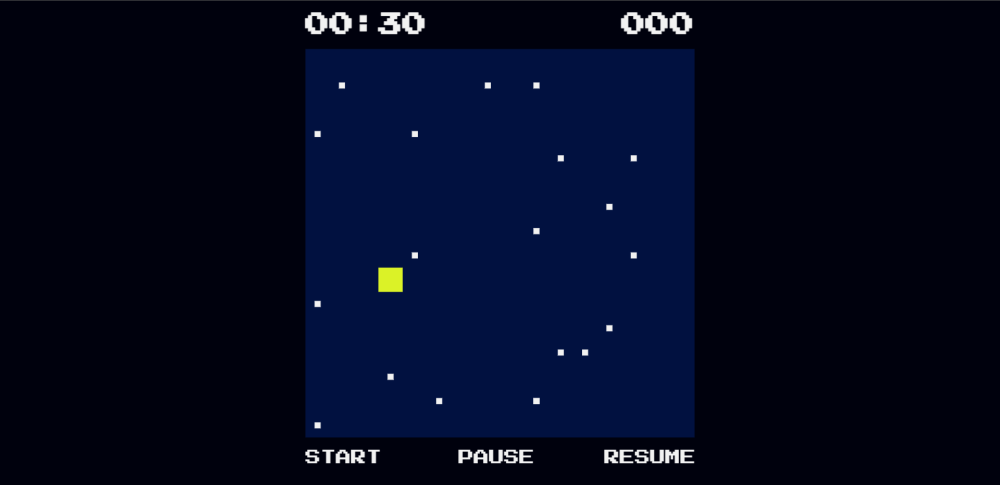
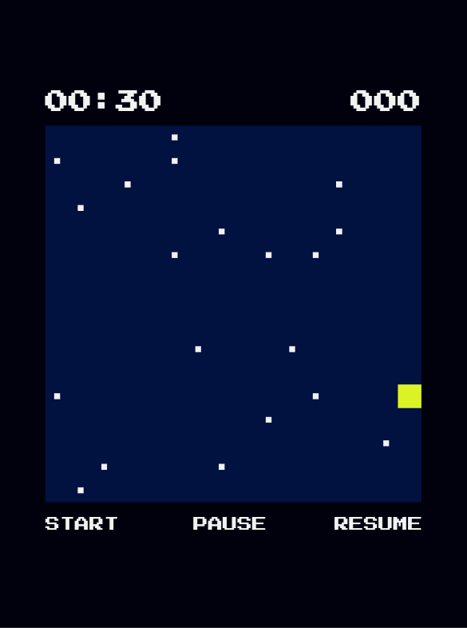
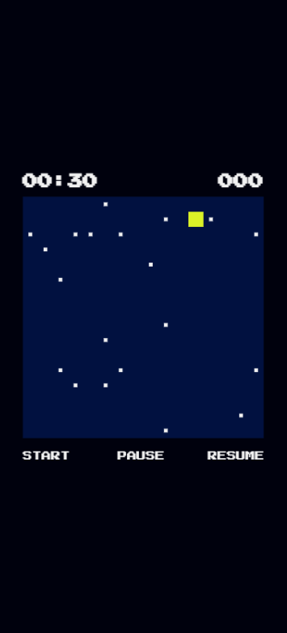

# Mini_Game

This is a mini-game built with HTML Canvas.
<ul>
  <li>Download and open the <b>index.html</b> file in your browser to run the game.</li>
  <li>Move the player using <b>W, A, S, D</b> or the arrow keys.</li>
  <li>Collect all the food before time runs out to win.</li>
</ul>
 

<h2>PC</h2>

 
<h2>Tab</h2>

 
<h2>Phone</h2>

